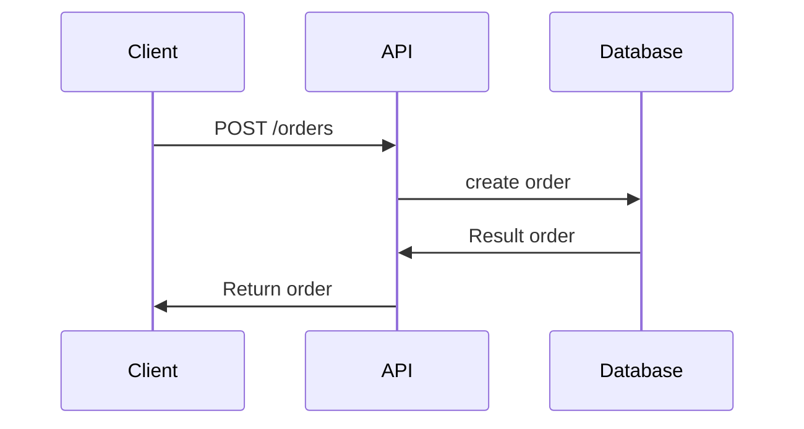

## POST Create Order

## Specification
* **API**: POST/orders
* 
### Request
```json
        {
          "user_id": 1,
          "product_id": 1
        }
```

### Response
```json
        {
              "id": 1,
              "user": {
                "id": 1,
                "username": "onepiecepura",
                "address": "4028 Stanley Avenue, Garden City, New York"
              },
              "shippingAddress": "4028 Stanley Avenue, Garden City, New York",
              "paymentMethod": "credit",
              "orderItems": [
                {
                  "id": 1,
                  "name": "Adidas Yeezy Boost 350 V2",
                  "description": "New arrival Beluga 2.0(AH2203)",
                  "category": "sneakers",
                  "brand": "Adidas",
                  "price": 28900.0,
                  "image": "/img/adidas_halo_lvory.jpg",
                  "size": 43
                }
              ]
       }
```

## Sequence Diagram
