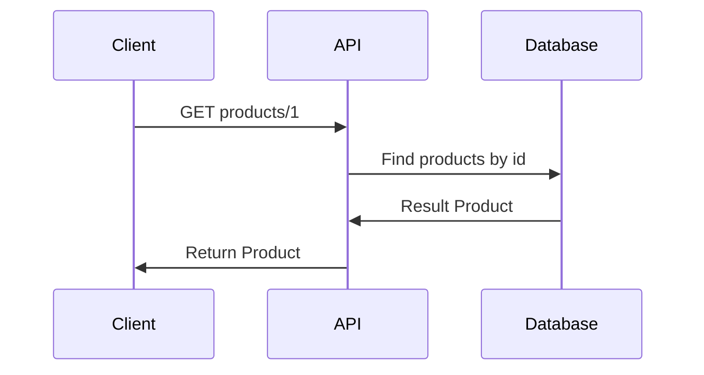

## GET Product By Id API

## Specification
* **API**: GET/products/{id}

### Response
```json
        {
            "id": 1,
            "name": "Adidas Yeezy Boost 350 V2",
            "description": "New arrival Beluga 2.0(AH2203)",
            "category": "sneakers",
            "brand": "Adidas",
            "price": 28900.0
        }
```

## Sequence Diagram
