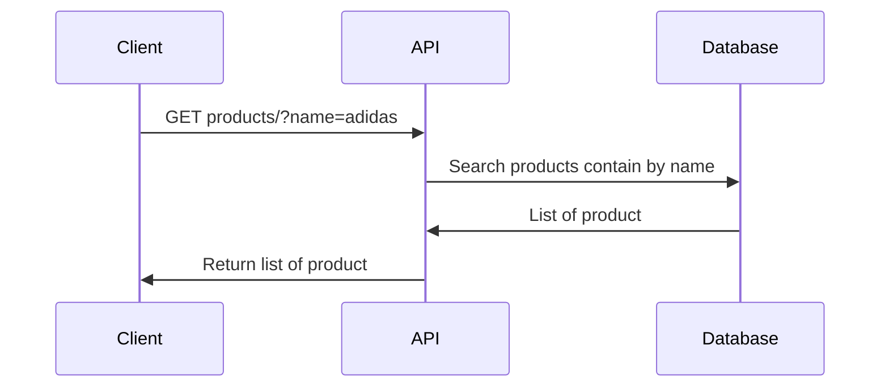

## Search Products API

## Specification
* **API**: GET/products?=name

### Response
```json
{
    "products": [
        {
            "id": 1,
            "name": "Adidas Yeezy Boost 350 V2",
            "description": "New arrival Beluga 2.0(AH2203)",
            "category": "sneakers",
            "brand": "Adidas",
            "price": 28900.0
        },
        {
            "id": 2,
            "name": "Adidas Ultraboost 5.0 DNA Shoes - Halo Ivory",
            "description": "5.0 DNA Shoes - Halo Ivory",
            "category": "sneakers",
            "brand": "Adidas",
            "price": 7000.0
        },
    ]
}
```

## Sequence Diagram
